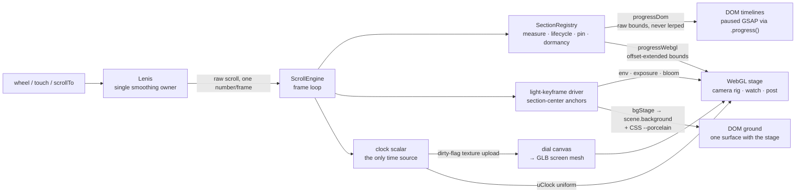
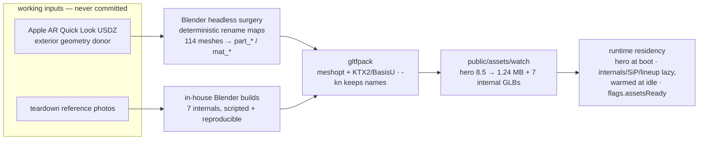

# ONE HERTZ · Architecture

> A web-craft study of "The Watch" by 60fps, product swapped to a faithful Apple Watch, with a
> measured likeness + beauty eval. Stack: Vite + vanilla TypeScript + three.js + GSAP + Lenis —
> no framework, because the engine is the point. This is the 2-page map; deep detail lives in the
> lane notes under [`docs/`](docs/).

## 1 · Engine — one scroll value, two progress channels

**Single smoothing owner.** Lenis is the only thing that smooths scroll. Every consumer reads the
same raw Lenis value each frame — no ScrollTrigger, no second smoother, no hidden lerp chains.
Consumers that want inertia own it explicitly (the camera rig keeps a `1−exp(−dt·8)` master lerp
and nothing else does). Pinning is pure CSS `position: sticky`; the engine never fakes a pin with
transforms, so the compositor does the work and the DOM stays honest.

**Section registry.** 15 tracks in frozen source order, each with a viewport-height budget from
recon (`core/constants.ts` is the single source of truth; key order *is* page order). The registry
measures real rects after layout, owns lifecycle (`enter/leave`, `enterCenter/leaveCenter` — fired
exactly once per boolean crossing, with direction), tracks pin state, and drives dormancy
(§4). Every section exposes **two progress channels**:

- **DOM channel** — raw track bounds, ticked raw every frame. Never lerped: pinned typography must
  track the finger exactly.
- **WebGL channel** — bounds extended by per-section offsets (negative start reaches into the
  previous section), so camera moves begin before a track arrives and land after it leaves.

Both channels drive **scrub adapters**: `{ duration, tick(progress) }`. A GSAP timeline registers
force-paused and is driven only via `.progress()` — scroll position is the sole animator, which is
what makes every frame a pure function of scroll (and the eval harness possible).

**One clock scalar.** A single clock (`core/clock.ts`) is the only time source: it feeds the
`uClock` WebGL uniform (idle motion), the canvas-rendered dial (uploaded to the GLB screen mesh on
a dirty flag — ~1 texture upload per 100+ frames), and CSS-side animation. Freeze the clock and
the whole page freezes. A **light-keyframe driver** samples section-center-anchored keys off the
same raw scroll — env rotation, exposure, bloom, and the stage ground color. `bgStage` writes
`scene.background` *and* CSS `--porcelain` together, so the DOM page and the WebGL stage darken as
one surface (the ink/porcelain split-stage grammar in [`docs/LOOKBIBLE.md`](docs/LOOKBIBLE.md)).

**State contracts + sandbox.** Sections declare `requiredEnterState` / `guaranteedExitState`
partials over five axes (`camera, explode, colorway, dialMode, postStack`). The registry folds
exit states over canonical order and **throws at boot** on contradiction — broken handoffs fail in
CI, not mid-scroll. `?solo=<Section>` mounts one track with its required state stubbed in: every
section gets a free dev sandbox with its own lighting, no separate harness.

## 2 · Asset pipeline — provenance, told straight

The exterior geometry donor is **Apple's own AR Quick Look USDZ** (the public apple.com preview
asset). Blender 4.5 headless surgery turns it into a usable web asset: obfuscated prim names are
mapped to a stable `part_* / mat_*` naming contract via deterministic rename maps (114/114 meshes,
verified with flat ID renders — hypotheses were rendered before they were believed), skinned bands
flatten to bind pose, and catalogued material defects (opaque crystal, marbled back-crystal, washed
Ocean band) are re-authored at runtime, not baked. The watch's **internals exist in no public
asset anywhere** — all 7 parts (SiP, battery, Taptic Engine, display laminate, speaker, sensor
array, crown assembly) were **modeled in-house** in scripted, headless-reproducible Blender from
teardown reference photography.

Everything funnels through **gltfpack** (meshopt quantization + KTX2/BasisU textures, `-kn` to
keep the name contract): the hero goes 8.5 MB → **1.24 MB**; internals compress ~3–5×. One trap
worth naming: gltfpack quantizes UVs and compensates with `KHR_texture_transform` per texture —
any runtime texture swap (the live dial, colorway maps) must copy the original transform or render
16×16 tiled. At runtime only the hero loads at boot; internals, the Movement SiP, and the footer
lineup are **lazy residents** — fetched and shader-warmed at idle, with a `flags.assetsReady`
contract so nothing pays first-draw cost mid-scroll (§4).

**What ships:** processed GLBs, KTX2 textures, and look JSONs in `public/assets/`. The raw USDZ
archives and reference photos are working inputs and are never committed. Full credits — "The
Watch" by 60fps, asset/HDRI/type sources — live in the site's end-slate and README.

## 3 · Determinism + eval harness

`?eval=1` makes the page a fixture: seeded RNG (`core/determinism.ts` replaces `Math.random` and
wall time everywhere), dial frozen at 10:09:30, BPM 64, ECG phase 0, idle motion derived from the
clock scalar — and the loader still waits for *real* asset readiness, skipping only choreography.
`window.__ONE_HERTZ__` exposes the machine-readable contract: the live section manifest,
`gotoSection(id, localProgress)` (synchronous settle in eval mode — every internal lerp snaps,
the final frame renders before the call returns), a versioned `state()` snapshot, `freezeClock`,
`forceQualityTier`, and renderer counters. On top sit `evals/`: capture (150+16 canonical frames
addressed by `(section, localProgress)`), assert (29 structural rubric checks — currently 29/29),
perf (rAF deltas over a scripted `lenis.scrollTo` pass with a longtask crosscheck), and a pixel
A/B against frozen references that guards every rendering change.

Beauty is gated by a **blind council**: 5 vision judges with fresh context, 24 matched-moment
pairs (20 stills + 4 scroll videos), left/right randomized per pair per judge under a sealed key,
forced A/B/tie per axis with one sentence of concrete evidence (evidence-less ballots void), plus
a deception probe — "which is the shipping professional site?". Gates: win-or-tie ≥60%, no axis
below 40%, ≥3 axes strictly above the source. Round 1 passed 5/5 gates (71.7% win-or-tie, 5/5
judges picked ours as the professional site): [`evals/results/beauty-r1/report.md`](evals/results/beauty-r1/report.md).

## 4 · Performance — the GC/bloom/compile hunt

The shipping build hid a real bug: hitches every ~7–10 s growing 60 → 285 ms, 11–14 frames >50 ms
per pass. Tracing pinned every hitch to V8 major GC — but the heap wasn't the story. The decisive
experiment: a forced full GC took **15 ms at rest and 165–341 ms mid-scroll on the same 28 MB
heap**, because per-frame style/layout churn across all 15 tracks was starving GC marking. Two
more layers underneath: a single shared bloom-darkening material flip-flopped its compiled program
across heterogeneous meshes every frame, and lazy content paid shader-compile bursts at first
visible draw — the boot `renderer.compile()` had warmed nothing, since tone mapping and output
colorspace are baked into the program cache key and the composer's render targets never matched
the canvas. Fixes were causes, not metrics: track dormancy via `content-visibility` with
hysteresis (a blanket rule was rejected because the pixel A/B caught it clipping a designed
cross-track type bleed), per-mesh WeakMap bloom materials, warming against the composer's actual
render target, and idle prebuilds behind the `assetsReady` flag. Result: 5/5 consecutive runs at
median 120.48 fps with 1–4 frames >50 ms, the mobile proxy from 40.0 to 120.5 median (3× the
floor), and 10/10 frames pixel-identical to the frozen references. Full numbers:
[`docs/p5/perf-hunt.md`](docs/p5/perf-hunt.md).

---

*Deep dives: engine contract [`docs/p1/engine.md`](docs/p1/engine.md) · GLB/look plumbing
[`docs/p15/plumbing.md`](docs/p15/plumbing.md) · light keyframes
[`docs/p2/infra-gl.md`](docs/p2/infra-gl.md) · look law [`docs/LOOKBIBLE.md`](docs/LOOKBIBLE.md)
· plan of record [`docs/PLAN.md`](docs/PLAN.md).*
