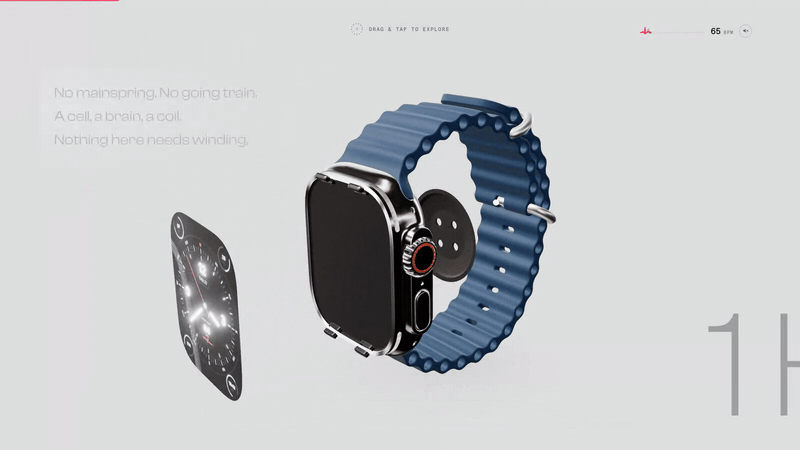

# ONE HERTZ

> **Tier:** showcase · **Status:** shipped · **Started:** 2026-08-20

A web-craft study of ["The Watch" by 60fps](https://thewatch.60fps.fr), product swapped to a faithful Apple Watch, with a measured likeness + beauty eval.

Built by **CHEN** ([chenthedigger](https://github.com/chenthedigger)).

<!-- DEMO REEL — GitHub renders drag-uploaded videos inline. To embed: edit this file
     on github.com and drag docs/media/demo-reel.mp4 into the line below; GitHub
     replaces it with a user-attachments URL that plays in-page. Until then the
     poster GIF + relative link below work everywhere, including local clones. -->

[](docs/media/demo-reel.mp4)

**Live:** [one-hertz.ubonranto.workers.dev](https://one-hertz.ubonranto.workers.dev) · desktop + mobile · try `?scroll=Nocturne`, hold anywhere to zoom

[](https://github.com/chenthedigger/one-hertz/actions/workflows/ci.yml)
[](LICENSE)
[](https://one-hertz.ubonranto.workers.dev)

---

## The problem

"The Watch" by 60fps is one of the best scrollytelling product pages on the open web — and like most agency work, everything that makes it good is invisible: the scroll physics, the scrub architecture, the interaction grammar. Rebuilding it is the only way to actually learn it. But a rebuild claim is cheap. "Looks close to me" is not a result.

So the project is two builds in one:

1. **The site** — the full scrollytelling experience, structure-faithful to the source, with the product swapped from a luxury mechanical watch to an Apple Watch Ultra 3 and the story rewritten around one thesis: *the watch regulated by a human heart* (the optical heart sensor samples at 1 Hz — the same beat a mechanical escapement gives away).
2. **The harness** — a reproducible eval that measures how close the rebuild actually is (structural likeness), whether it is actually good (blind beauty council vs the source), and whether it actually runs (frame-time gates on named hardware). Every number in this README comes out of that harness.

## What was built

- **15 scroll sections** in source order — loader with an activity-rings → 3D match cut, hero, two word-stacks, horology-to-silicon exploded view, live-scrubbed ECG, BPM catalog cards (58 / 96 / 142 over a shared /220 denominator), hover-swapped dial complications, per-finish editorial gallery, **1 Hz Nocturne** (darkness radiates from the dial; the Always-On face ticks on real wall-clock seconds — the only moment the watch itself moves on real time), CALIBRE 1HZ spec ledger, and a four-watch outro whose SWAP restarts the site in the chosen finish.
- **5 interaction mechanics** — cursor state machine (text + icon channels), long-press hold-zoom anywhere (Lenis stops, camera dollies, mechanism accelerates), exploded view with per-part hitboxes and annotations, colorway swap (2 titanium finishes × real Ocean band colors, every combination orderable on apple.com), and the outro restart loop.
- **A scroll engine from scratch** — no framework. Vite + vanilla TypeScript + three.js + GSAP + Lenis. One smoothing owner (Lenis, duration 4), CSS sticky pinning, per-section paused timelines scrubbed as pure functions of progress, dual WebGL/DOM channels per section, a typed event bus, and a `?eval=1` debug transport the harness drives.
- **7 in-house internals** — Taptic Engine, SiP, battery, display laminate, Digital Crown assembly (72-tooth encoder, coaxial stack), speaker cassette, and the sensor-array back dome with its foam-peel beat — all modeled in Blender from iFixit teardown references, because no Apple Watch internals asset exists anywhere.
- **A dial subsystem** — the watch face is a live canvas: complications (depth gauge / heart rate / compass) hot-swap on hover, glyphs are rendered in-canvas (no font files shipped), and in Nocturne it phase-aligns to real seconds.
- **Authored look** — lighting rig, environment (zero stock pixels in the shipped env), material grade, and post stack were developed through a three-way look shootout and frozen as an in-repo look bible; the gallery is Cycles renders of the same GLB under the same rig, sharing one LUT with realtime.

Architecture, contracts, and the asset pipeline (including provenance) are in **[ARCHITECTURE.md](ARCHITECTURE.md)**.

## Results

All numbers are reproducible from committed result files; every report cites the rubric version it ran against ([`evals/rubric.yaml`](evals/rubric.yaml), v1.1.0). One scope note: the frozen source captures of thewatch.60fps.fr are not committed (heavy media, regenerable via `evals/reference/source/capture-scripts/`), so `npm run eval` regenerates the ours side only — and the beauty-gate math is independently recomputable from the committed [`evals/judge/ballots.json`](evals/judge/ballots.json) + sealed [`evals/judge/pack/answers.json`](evals/judge/pack/answers.json).

### Beauty — blind council vs the source, gate PASS 5/5

Method: 5 fresh-context blind vision judges scored 24 matched-moment pairs (20 stills + 4 scripted video strips, desktop + mobile) of ours vs frozen source captures, sides randomized per pair per seat, sealed answer key. Full report with per-ballot rationales: [`evals/results/beauty-r1/report.md`](evals/results/beauty-r1/report.md).

| Gate | Rule | Result | Verdict |
|---|---|---|---|
| Overall | win-or-tie ≥ 60% | **86/120 = 71.7%** | PASS |
| Axis floor | no axis < 40% | worst axis 66.7% (material) | PASS |
| Exceed clause | ≥ 3 axes above source | **5/5 axes** strictly above | PASS |
| Deception probe | judges picking ours as amateur = fail | **5/5 seats picked ours as the professional site** | PASS |
| Agreement | < 70% flags review | 77.5% mean pairwise | not flagged |

Honest caveat, from the report: the 71.7% is a claim about these 24 frozen moments, not every scroll position — several source losses are its own mid-transition states, and ours were punished identically.

### Structural likeness — 29/29

Rubric assert run: **29 PASS, 0 FAIL, 0 SKIP** — zero criticals, pass rate 1.0, gate PASS ([`evals/results/p5-integrate/assert.json`](evals/results/p5-integrate/assert.json)). Items cover section order, all five mechanics (including long-press Lenis-stop and the outro restart), dual scrub speeds, lifecycle events, and loader honesty — each asserted through the engine's `__ONE_HERTZ__.state()` contract or judge-verified.

### Performance — named hardware, 5/5 stable runs

Machine: MacBook Pro, Apple M5 Pro, 24 GB · macOS 26.4.1 · Chrome 151 headless (playwright-core, real Chrome channel). Gates: median ≥ 55 fps · p95 ≤ 22 ms · frames > 50 ms ≤ 5. Raw frametimes: [`evals/results/p5-perf-hunt/`](evals/results/p5-perf-hunt/).

| Run (desktop 1600×900) | median fps | p95 frame | frames > 50 ms |
|---|---|---|---|
| stability-1 | 120.48 | 10.0 ms | 1 |
| stability-2 | 120.48 | 10.0 ms | 4 |
| stability-3 | 120.48 | 10.1 ms | 1 |
| stability-4 | 120.48 | 10.3 ms | 4 |
| stability-5 | 120.48 | 10.1 ms | 2 |

Five identical medians are real, not pasted: the median is pinned at the 120 Hz display cap (rAF quantization) — it reads 120.48 whenever the majority of frames hit vsync, so p95 and the >50 ms count carry the between-run signal.

Mid-tier proxy (390×844 @ DPR 3, 6× CPU throttle — GPU unthrottled, so this is a CPU proxy, not a device claim): median **120.48 fps**, p95 10.9 ms, 3.0× the 40 fps floor. Before the P5 root-cause round the same proxy sat at exactly 40.0. The fixes (track dormancy, per-mesh bloom materials, correct-variant shader warm, idle prebuilds) are documented with the GC traces that found them in [`docs/p5/perf-hunt.md`](docs/p5/perf-hunt.md), and 10/10 frames are pixel-identical to the frozen pre-fix references — cause fixes, not gate gaming.

| Transfer | Before | After |
|---|---|---|
| First load to networkidle | 15.96 MB / 54 req | **3.94 MB** / 36 req (−75%) |
| Deployed worker assets | 21.7 MB | **8.7 MB** |

### Reproduce

The harness drives the production build on the local preview server (`http://localhost:4173`), so build + serve first:

```bash
npm run build         # production build (tsc + vite)
npm run preview &     # serve it — the harness's default target
npm run eval          # full round: capture → assert → perf (desktop + mobile proxy) → judge scaffold → report
npm run eval:assert   # structural rubric only
npm run eval:perf     # frame-time gates (writes frametimes + machine.json)
```

## Run it locally

```bash
git clone https://github.com/chenthedigger/one-hertz && cd one-hertz
npm install
npm run dev
```

`npm run build && npm run preview` for the production build. The eval harness needs Google Chrome installed (it drives the real Chrome channel via playwright-core).

## Credits & licensing

- **Design language**: this is a study of ["The Watch"](https://thewatch.60fps.fr) by [60fps](https://60fps.fr) — structure, scroll grammar, and interaction vocabulary are theirs; the product, story, copy, look, engine, and all code are this repo's. Never presented as original design.
- **Apple Watch Ultra 3** is Apple's product, referenced nominatively. Hero geometry derives from Apple's public product-page USDZ (geometry donor; every material re-authored in-house). Internals are modeled from scratch against iFixit teardown photography. Specs quoted in copy are verified against apple.com.
- **Environment/lighting**: authored in-house (zero stock pixels in the shipped env). Poly Haven ["Studio Small 03"](https://polyhaven.com/a/studio_small_03) (CC0) remains in the repo as a dev-only fallback and is excluded from deploy.
- **Type**: Clash Display (Fontshare / ITF Free Font License), Inter, Geist Mono, Fraunces (SIL OFL) — all self-hosted woff2 subsets. Dial glyphs are rendered into canvas; no system font files ship in the repo.
- **Code**: [MIT](LICENSE).

---

*Product references and specs as of watchOS 26, August 2026.*
